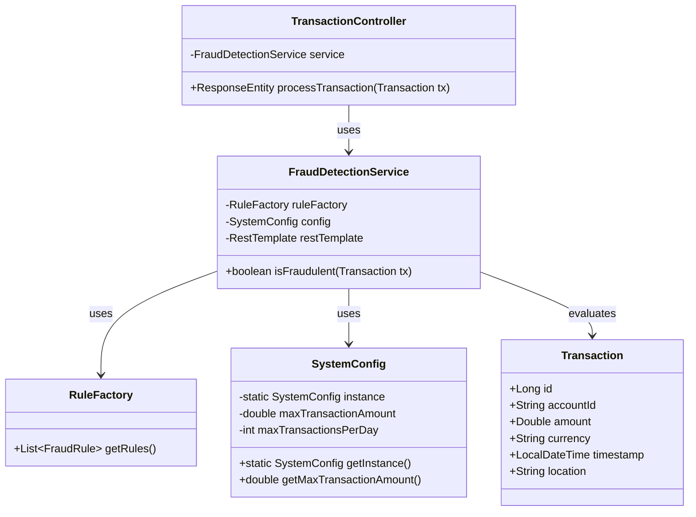
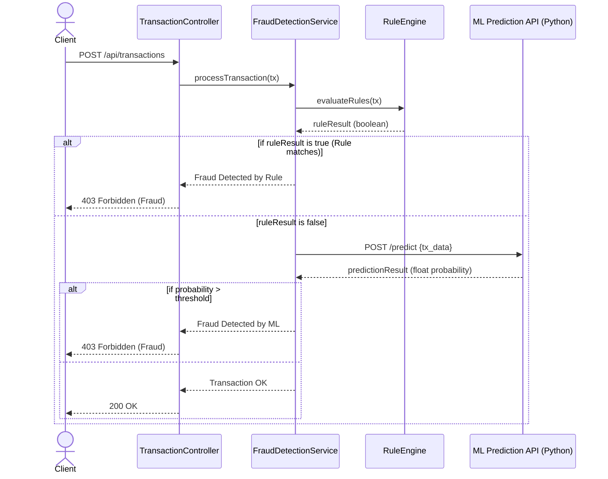

# Fraud Detection System Architecture

This document contains UML diagrams describing the behavior and structure of the system.

## Class Diagram

```mermaid
classDiagram
    class Transaction {
        +Long id
        +String accountId
        +Double amount
        +String currency
        +LocalDateTime timestamp
        +String location
    }

    class FraudDetectionService {
        -RuleFactory ruleFactory
        -SystemConfig config
        -RestTemplate restTemplate
        +boolean isFraudulent(Transaction tx)
    }

    class RuleFactory {
        +List~FraudRule~ getRules()
    }

    class SystemConfig {
        -static SystemConfig instance
        -double maxTransactionAmount
        -int maxTransactionsPerDay
        +static SystemConfig getInstance()
        +double getMaxTransactionAmount()
    }

    class TransactionController {
        -FraudDetectionService service
        +ResponseEntity processTransaction(Transaction tx)
    }

    TransactionController --> FraudDetectionService : uses
    FraudDetectionService --> RuleFactory : uses
    FraudDetectionService --> SystemConfig : uses
    FraudDetectionService --> Transaction : evaluates
```

## Sequence Diagram

```mermaid
sequenceDiagram
    actor Client
    participant Controller as TransactionController
    participant Service as FraudDetectionService
    participant Rules as RuleEngine
    participant ML as ML Prediction API (Python)

    Client->>Controller: POST /api/transactions
    Controller->>Service: processTransaction(tx)
    Service->>Rules: evaluateRules(tx)
    Rules-->>Service: ruleResult (boolean)

    alt if ruleResult is true (Rule matches)
        Service-->>Controller: Fraud Detected by Rule
        Controller-->>Client: 403 Forbidden (Fraud)
    else ruleResult is false
        Service->>ML: POST /predict {tx_data}
        ML-->>Service: predictionResult (float probability)
        
        alt if probability > threshold
            Service-->>Controller: Fraud Detected by ML
            Controller-->>Client: 403 Forbidden (Fraud)
        else
            Service-->>Controller: Transaction OK
            Controller-->>Client: 200 OK
        end
    end
```
